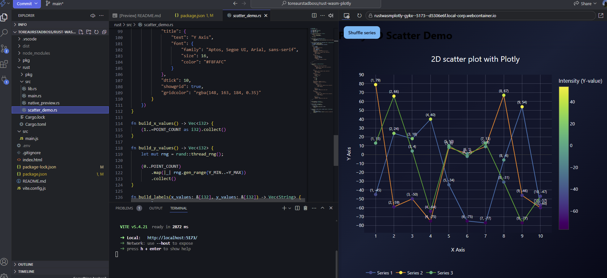
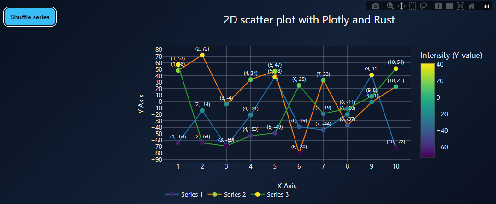

# StackBlitz ready Plotly 2D scatter demo

This project is set up to run in StackBlitz from [this GitHub import link](https://stackblitz.com/~/github.com/toreaurstadboss/rust-wasm-plotly). The browser app is the primary entry point: Vite serves the page, Rust generates the scatter plot spec, and the JavaScript loader only initializes wasm and hands the JSON to Plotly.

If you want the local Rust preview, run `cargo run` from the `rust/` folder. That path is optional and local-only: it generates a standalone `2dscatter.html` on disk and is not used by StackBlitz.

The browser demo keeps almost all plot logic in Rust. The `src/main.js` file is a thin loader, and the checked-in `pkg/` output lets StackBlitz start without rebuilding wasm first.

## Run locally

1. Install dependencies.

```bash
npm install
```

2. Start the development server.

```bash
npm run dev
```

3. Open the URL shown by Vite, usually `http://localhost:5173`.

## Optional wasm rebuild

If you want to regenerate the Rust/WASM output in `pkg/`, run:

```bash
npm run build:wasm
```

## Native Rust preview

```bash
cd rust
cargo run
```

That writes `2dscatter.html` at the workspace root and opens it on Windows. Use this only for local previewing; StackBlitz uses the Vite app in the repository root.


## Screenshots



